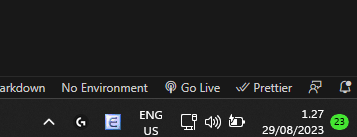

# Responsive design


This project was created as a mock-up version to [this page](https://preview.themeforest.net/item/maido-multipurpose-ghost-blog-theme/full_screen_preview/24837109?_ga=2.259990478.570486835.1654146705-2133876429.1654146705). Several techniques like Flex Box and Grid were utilized in the coding process.

## Table of content

1. [Technologies](#technologies)
2. [Project Structure](#project-structure)
3. [Getting Started](#getting-started)

## Technologies

- HTML5
- SASS

## Project Structure
````
├── styles
|   ├──styles.scss
|   └──typed.scss
├── index.html
├── style.css
├── style.css.map
├──image.png
├──package.json
└──README.md

````

## Getting Started

1. Open your terminal and clone the repository with the following command: 
```
git clone https://github.com/tduyphat/fs16_2-responsive-design
```

2. Open the "index.html" file in Visual Studio Code and click on "Go Live" to open the web page (see the image below).



3. Or simply access the web page through the deployed version on Netlify: https://phat-tran-maido.netlify.app/


